# NexusGuard Microinsurance dApp — Full Stack Evolution

## Background

The project currently has:
- **7 Soroban smart contracts** (pool, claims, voting, governance, token, payout, smart_account) — all functional with unit tests
- **Next.js 16 frontend** with TypeScript types, services, hooks, and components (scaffold stage, awaiting Figma designs)
- **No backend** — the current architecture is frontend + smart contracts only

The user now wants to evolve this into a **production-grade full-stack dApp** with three major new capabilities:

1. **Stellar Smart Accounts** — already implemented, used for recurring weekly contributions, spending limits, multisig, and scheduled transfers
2. **x402 Payment Layer** — HTTP 402-based automatic micropayments for anti-spam, payment verification, and gated API access
3. **Node.js Backend** — claim verification, fraud detection, notifications, IPFS file uploads

> [!NOTE]
> The frontend will NOT be built in this phase — the user will provide Figma screens later. We focus on **backend**, **x402 integration**, and **contract enhancements** only.

---

## User Review Required

> [!IMPORTANT]
> **New Backend Service**: This plan introduces a Node.js/Express backend (`/backend`) as a sibling to `/frontend` and `/contracts`. This is a significant architectural change from the previous "no backend" design. The backend becomes the x402-protected API gateway and handles all off-chain concerns.

> [!IMPORTANT]
> **x402 Stellar SDK**: We will use the official `@x402/stellar`, `@x402/express`, `@x402/core` packages. These require a Stellar wallet keypair for the facilitator/server side. You will need to configure a **Stellar testnet secret key** in the `.env` for the backend to sign x402 payment verifications.

> [!WARNING]
> **IPFS Provider**: The plan uses **Pinata** for IPFS pinning (via their REST API). If you prefer a different IPFS provider (NFT.Storage, web3.storage, Infura IPFS), let me know and I'll adjust.

---

## Open Questions

> [!IMPORTANT]
> 1. **Notification Channel**: For notifications, should we start with email (via a service like Resend/SendGrid), or should we use in-app notifications stored in a database (e.g., SQLite/PostgreSQL)?  
> I recommend starting with **in-app notifications** stored in a local JSON file or SQLite for simplicity, and adding email later.

> [!IMPORTANT]
> 2. **Fraud Detection Scope**: For the initial fraud detection, I plan to implement **rule-based checks** (duplicate claim detection, velocity checks, amount anomaly detection). Should we also integrate any external ML/AI service, or is rule-based sufficient for MVP?

> [!IMPORTANT]
> 3. **Database**: The backend needs some persistence for notifications, fraud logs, and cached claim data. Should I use **SQLite** (zero-config, file-based) or would you prefer **PostgreSQL** for production-readiness?

---

## Proposed Changes

### Component Overview

```mermaid
graph TB
    subgraph "Client Layer"
        FE["Next.js Frontend<br/>(future - Figma)"]
    end
    
    subgraph "x402 Payment Layer"
        X402M["x402 Express Middleware"]
        X402F["x402 Facilitator<br/>(Stellar)"]
    end
    
    subgraph "Backend (Node.js/Express)"
        API["REST API Gateway"]
        CV["Claim Verification<br/>Service"]
        FD["Fraud Detection<br/>Engine"]
        NF["Notification<br/>Service"]
        IPFS["IPFS Upload<br/>Service"]
        KE["Keeper Service<br/>(Smart Account Executor)"]
    end
    
    subgraph "Blockchain (Stellar/Soroban)"
        SA["Smart Account<br/>Contract"]
        PC["Pool Treasury<br/>Contract"]
        CC["Claims Contract"]
        VC["Voting Contract"]
        GC["Governance Contract"]
        PE["Payout Engine<br/>Contract"]
        TK["Token Contract"]
    end
    
    subgraph "External"
        PIN["Pinata IPFS"]
        SNET["Stellar Testnet"]
    end
    
    FE --> X402M
    X402M --> X402F
    X402M --> API
    API --> CV
    API --> FD
    API --> NF
    API --> IPFS
    API --> KE
    KE --> SA
    CV --> CC
    IPFS --> PIN
    SA --> PC
    SA --> TK
    CC --> GC
    GC --> VC
    GC --> PE
    PE --> PC
    All Contracts --> SNET
```

---

### 1. Backend — Node.js/Express Service

#### [NEW] [backend/](file:///home/dp/Documents/nexusGuard/backend/)

Full directory structure:

```
backend/
├── package.json
├── tsconfig.json
├── .env.example
├── src/
│   ├── index.ts                    # Express app entry point
│   ├── config/
│   │   └── index.ts                # Environment config loader
│   ├── middleware/
│   │   ├── x402.middleware.ts       # x402 payment-gating middleware
│   │   ├── auth.middleware.ts       # Stellar wallet auth verification
│   │   └── error.middleware.ts      # Global error handler
│   ├── routes/
│   │   ├── claims.routes.ts         # Claim submission, verification, status
│   │   ├── ipfs.routes.ts           # IPFS upload endpoints
│   │   ├── notifications.routes.ts  # Notification CRUD
│   │   ├── pools.routes.ts          # Pool data aggregation
│   │   └── health.routes.ts         # Health check
│   ├── services/
│   │   ├── claim-verification.service.ts   # Evidence validation, cross-referencing
│   │   ├── fraud-detection.service.ts      # Rule-based fraud detection engine
│   │   ├── notification.service.ts         # In-app notification management
│   │   ├── ipfs.service.ts                 # Pinata IPFS pinning
│   │   ├── keeper.service.ts               # Smart Account recurring payment executor
│   │   └── soroban.service.ts              # Soroban RPC client wrapper
│   ├── types/
│   │   └── index.ts                        # Backend-specific TypeScript types
│   └── utils/
│       ├── stellar.ts                      # Stellar SDK helpers
│       └── logger.ts                       # Structured logging utility
```

##### Key Dependencies
```json
{
  "dependencies": {
    "express": "^5.1.0",
    "@x402/express": "^0.2.0",
    "@x402/stellar": "^0.2.0",
    "@x402/core": "^0.2.0",
    "@stellar/stellar-sdk": "^13.1.0",
    "multer": "^2.0.0",
    "dotenv": "^16.5.0",
    "cors": "^2.8.5",
    "helmet": "^8.0.0",
    "node-cron": "^3.0.3"
  }
}
```

---

### 2. x402 Payment Layer Integration

#### [NEW] [x402.middleware.ts](file:///home/dp/Documents/nexusGuard/backend/src/middleware/x402.middleware.ts)

The x402 middleware will protect specific backend routes to:
- **Anti-spam**: Gate claim submissions behind a micro-payment (e.g., 0.01 USDC) to prevent spam claims
- **Payment verification**: Automatically verify that the caller has paid before processing requests
- **Automatic micropayments**: Enable machine-to-machine payments for automated services (keeper bots, etc.)

**Protected Routes:**
| Route | Payment Amount | Purpose |
|---|---|---|
| `POST /api/claims/submit` | 0.01 USDC | Anti-spam claim submission |
| `POST /api/ipfs/upload` | 0.005 USDC | IPFS upload cost recovery |
| `GET /api/claims/:id/verify` | 0.001 USDC | Detailed claim verification report |

**Non-protected Routes:**
| Route | Purpose |
|---|---|
| `GET /api/health` | Health check |
| `GET /api/pools` | Public pool listing |
| `GET /api/notifications/:address` | User notifications |

---

### 3. Backend Services — Detailed Design

#### [NEW] [claim-verification.service.ts](file:///home/dp/Documents/nexusGuard/backend/src/services/claim-verification.service.ts)

Responsibilities:
- Verify evidence files exist on IPFS (hash validation)
- Cross-reference claim amount against pool's max payout
- Check claimant is an active pool member (via Soroban RPC)
- Validate claim doesn't duplicate an existing claim
- Return structured verification report

#### [NEW] [fraud-detection.service.ts](file:///home/dp/Documents/nexusGuard/backend/src/services/fraud-detection.service.ts)

Rule-based fraud detection engine with configurable rules:
1. **Duplicate Detection**: Same claimant, same pool, similar description within 30 days
2. **Velocity Check**: More than 3 claims in 90 days from same address
3. **Amount Anomaly**: Claim amount > 80% of pool's max payout
4. **New Member Check**: Claim filed within 7 days of joining pool
5. **Pattern Matching**: Multiple claims across different pools from same address

Each rule returns a **risk score** (0-100). Aggregate score determines:
- `0-30`: Low risk → auto-proceed
- `31-60`: Medium risk → flag for manual review
- `61-100`: High risk → flag for governance vote

#### [NEW] [notification.service.ts](file:///home/dp/Documents/nexusGuard/backend/src/services/notification.service.ts)

In-app notification system:
- Contribution reminders (weekly)
- Claim status updates
- Vote requests
- Payout confirmations
- Fraud alerts (for pool admins)
- Smart Account execution confirmations

Stored in a JSON file (`data/notifications.json`) for MVP simplicity.

#### [NEW] [ipfs.service.ts](file:///home/dp/Documents/nexusGuard/backend/src/services/ipfs.service.ts)

Pinata IPFS integration:
- Upload claim evidence files (images, documents, videos)
- Pin files with metadata tags (claim_id, pool_id)
- Retrieve pinned content by CID
- Validate CID existence

#### [NEW] [keeper.service.ts](file:///home/dp/Documents/nexusGuard/backend/src/services/keeper.service.ts)

Automated "keeper" service that:
- Polls the Smart Account contract for due recurring payments
- Calls `execute_recurring` when `next_execution <= now`
- Polls for executable scheduled transfers
- Calls `execute_scheduled` when `execute_after <= now`
- Runs on a cron schedule (every 15 minutes)
- Logs all execution results

#### [NEW] [soroban.service.ts](file:///home/dp/Documents/nexusGuard/backend/src/services/soroban.service.ts)

Shared Soroban RPC client:
- Build and submit transactions
- Read contract state (pool balances, claim data, vote tallies)
- Query Smart Account entries (recurring payments, scheduled transfers)

---

### 4. Smart Contract Enhancements

#### [MODIFY] [lib.rs (smart_account)](file:///home/dp/Documents/nexusGuard/contracts/contracts/smart_account/src/lib.rs)

Enhancements to better support the keeper service and x402 integration:

1. **Add `get_due_payments` view function**: Returns IDs of all recurring payments that are currently executable (past due date). This allows the keeper to efficiently query which payments need execution.

2. **Add `get_due_scheduled` view function**: Returns IDs of all scheduled transfers that are past their `execute_after` timestamp.

3. **Add events**: Emit Soroban events on successful executions for off-chain indexing:
   - `RecurringExecuted(payment_id, amount, timestamp)`
   - `ScheduledExecuted(transfer_id, amount, timestamp)`
   - `SpendingLimitUpdated(owner, token, new_spent)`
   - `MultisigExecuted(proposal_id, amount, timestamp)`

#### [MODIFY] [lib.rs (claims)](file:///home/dp/Documents/nexusGuard/contracts/contracts/claims/src/lib.rs)

1. **Add `evidence_cid` field**: Store IPFS CID alongside `evidence_ipfs` for structured retrieval
2. **Add events**: Emit events for claim lifecycle:
   - `ClaimSubmitted(claim_id, claimant, amount)`
   - `ClaimStatusUpdated(claim_id, old_status, new_status)`
   - `ClaimPaidOut(claim_id, amount, recipient)`

#### [MODIFY] [lib.rs (pool)](file:///home/dp/Documents/nexusGuard/contracts/contracts/pool/src/lib.rs)

1. **Add `get_pool_info` view function**: Return a comprehensive PoolInfo struct with all pool state
2. **Add events**: Emit events for contributions and disbursements:
   - `ContributionReceived(member, amount, new_total)`
   - `DisbursementExecuted(recipient, amount, remaining_total)`

#### [MODIFY] [lib.rs (payout)](file:///home/dp/Documents/nexusGuard/contracts/contracts/payout/src/lib.rs)

1. **Add cross-contract call**: Actually invoke `pool.disburse()` in `execute_payout` instead of the current TODO
2. **Add events**: Emit events for payout lifecycle

---

### 5. Project Root Updates

#### [MODIFY] [README.md](file:///home/dp/Documents/nexusGuard/README.md)

Update to reflect the new three-tier architecture:
- Add backend section to tech stack table
- Add x402 payment layer explanation
- Update project structure to include `/backend`
- Add backend setup instructions

#### [NEW] [.gitignore](file:///home/dp/Documents/nexusGuard/backend/.gitignore)

Node.js gitignore for backend.

---

## Execution Order

```mermaid
gantt
    title Implementation Phases
    dateFormat  X
    axisFormat %s
    
    section Phase 1 - Backend Foundation
    Scaffold backend project          :p1a, 0, 1
    Config & environment setup        :p1b, 1, 2
    Express app with health route     :p1c, 2, 3
    Soroban service wrapper           :p1d, 3, 4
    
    section Phase 2 - Core Services
    IPFS service (Pinata)             :p2a, 4, 5
    Claim verification service        :p2b, 5, 6
    Fraud detection engine            :p2c, 6, 7
    Notification service              :p2d, 7, 8
    
    section Phase 3 - x402 Integration
    x402 middleware setup             :p3a, 8, 9
    Protected routes config           :p3b, 9, 10
    Payment verification flow         :p3c, 10, 11
    
    section Phase 4 - Keeper & Automation
    Keeper service                    :p4a, 11, 12
    Cron job scheduling               :p4b, 12, 13
    
    section Phase 5 - Contract Enhancements
    Smart Account view functions      :p5a, 13, 14
    Contract events                   :p5b, 14, 15
    Cross-contract payout             :p5c, 15, 16
    
    section Phase 6 - API Routes
    Claims routes                     :p6a, 16, 17
    IPFS routes                       :p6b, 17, 18
    Notification routes               :p6c, 18, 19
    Pool routes                       :p6d, 19, 20
    
    section Phase 7 - Verification
    Contract compilation & tests      :p7a, 20, 21
    Backend startup & health check    :p7b, 21, 22
    README update                     :p7c, 22, 23
```



---

## Verification Plan

### Automated Tests

1. **Soroban Contract Tests**
```bash
cd contracts && cargo test
```
- Verify all 7 contracts compile and pass existing + new tests
- Verify new view functions (`get_due_payments`, `get_due_scheduled`)
- Verify event emissions

2. **Backend Compilation**
```bash
cd backend && npm run build
```
- Verify TypeScript compiles without errors

3. **Backend Startup**
```bash
cd backend && npm run dev
```
- Verify Express starts on configured port
- Verify `/api/health` returns 200

### Manual Verification
- Verify x402 middleware returns 402 on protected routes without payment
- Verify IPFS upload service can pin a test file (requires Pinata API key)
- Verify keeper service can read Smart Account contract state via Soroban RPC
